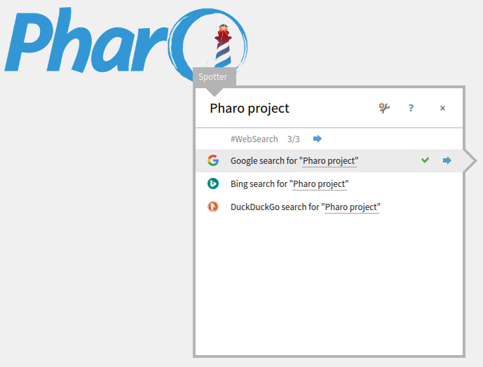

# Pharo-WebSearch
A simple Spotter websearch for Pharo. Just enter your search term in spotter and letter Pharo open a browser to query the term using one of the given search engines.

## Installation

```Smalltalk
Metacello new 
	repository: 'github://astares/Pharo-WebSearch/src';
	baseline: 'WebSearch';
	load 	
```

## Screenshot



